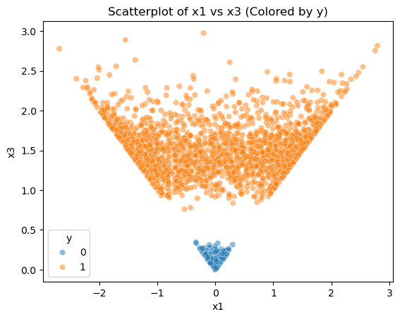
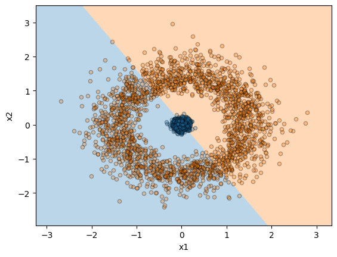
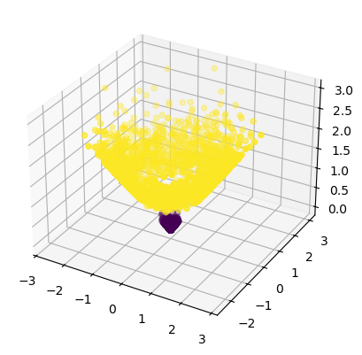
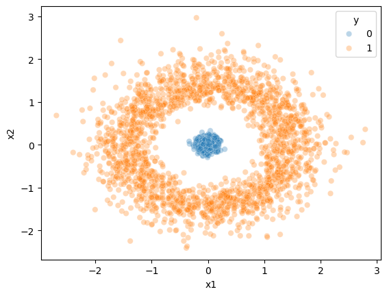

# Support Vector Machine Classification & Manual Feature Engineering

This project explores how Support Vector Machines (SVMs) can classify non-linearly separable data and compares SVM performance against traditional logistic regression. The analysis demonstrates how feature engineering can transform data into a space where linear classification becomes possible.

The project walks through:
- Synthetic data generation
- Logistic regression classification
- SVM classification with kernel tuning
- Feature engineering using radial distance
- Decision boundary visualization
- Model performance evaluation

---

# Project Objective

The objective of this project was to analyze how machine learning models behave when classes are not linearly separable and demonstrate how Support Vector Machines can learn complex classification boundaries.

The project also highlights how manually engineered features can improve the performance of simpler linear models.

---

# Tools & Libraries

- Python
- Pandas
- NumPy
- Matplotlib
- Seaborn
- Scikit-learn

---

# Key Concepts Demonstrated

- Logistic Regression
- Support Vector Machines (SVM)
- Radial Basis Function (RBF) Kernel
- Feature Engineering
- Decision Boundary Visualization
- Hyperparameter Tuning
- Classification Metrics
- Non-Linear Classification

---

# Dataset Overview

A synthetic dataset was generated containing two classes:

- Class 0 concentrated near the center
- Class 1 distributed in a circular outer region

This structure creates a non-linear classification problem that traditional logistic regression struggles to separate.

---

# Initial Data Visualization

## Original Two-Predictor Dataset



The dataset shows a circular separation pattern where the classes cannot be divided using a straight linear boundary.

---

# Logistic Regression Performance

## Logistic Regression Decision Boundary



The logistic regression model struggles because it attempts to separate the classes using a linear boundary.

### Logistic Regression Results
- Accuracy: 58.9%
- Precision: 60.8%
- Recall: 50.3%

---

# Support Vector Machine Classification

A Support Vector Machine with an RBF kernel was trained using GridSearchCV to tune the gamma parameter.

## SVM Decision Boundary


The SVM successfully learned the circular decision boundary and perfectly separated the classes.

### SVM Results
- Accuracy: 100%
- Precision: 100%
- Recall: 100%

---

# Feature Engineering

To better understand how the SVM separated the data, a new engineered feature was created:

```python
x3 = sqrt(x1² + x2²)
```

This transformed the data into a space where the classes became linearly separable.

## 3D Feature Space Visualization



---

# Transformed Predictor Relationship

## Scatterplot of x1 vs x3



The engineered feature reveals how radial distance from the origin drives class separation.

---

# Key Insights

- Logistic regression performs poorly on non-linear datasets without engineered features.
- SVMs can learn highly complex decision boundaries using kernel transformations.
- Feature engineering can transform non-linear problems into linearly separable ones.
- Visualization is critical for understanding model behavior and classification structure.

---

# Repository Structure

```text
Support-Vector-Machine-Classification/
│
├── README.md
├── Support Vector Machine Classification & Manual Feature Engineering.ipynb
├── utils_DA.py
│
├── Images/
│   ├── Scatterplot.png
│   ├── Decision Boundary.png
│   ├── Invert.png
│   ├── 3-D-Scatterplot.png
│   └── 2-Predictors.png
│
└── .gitignore
```

---

# Future Improvements

Potential future enhancements include:
- Adding polynomial feature transformations
- Comparing additional kernel functions
- Expanding hyperparameter optimization
- Applying the workflow to real-world datasets
- Adding interactive visualizations

---

# Portfolio

Portfolio Website: https://cameronbatts.github.io/

GitHub Profile: https://github.com/cameronbatts
